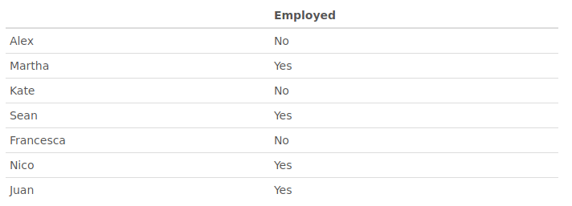

options(tutorial.exercise.timelimit = 10)


```{r setup, include=FALSE}
library(learnr)
library(checkr)
library(knitr)
knitr::opts_chunk$set(echo = FALSE, exercise.checker = checkr::checkr_tutor)
```


## Lists

*Enter your code directly into the chunks and press the 'Run Code' button to execute it.
There are multiple exercises for each topic, you must complete an exercise and press 'Continue'
to move onto the next one. Only once a tick mark appears next to every exercise should you 
be able to continue to the next section.*

**Lists** are objects which can contain **data of different types and sizes**.

### Exercise 1

```{r pS1}
calendar <- list(1910:2017, 
                  c("Jan", "Feb", "Mar", "Apr", "May", "Jun", "Jul", "Aug", "Sep", "Oct", "Nov", "Dec"),
                  1:31)

calendar2 <- list(year = 1910:2017, 
                  month = c("Jan", "Feb", "Mar", "Apr", "May", "Jun", "Jul", "Aug", "Sep", "Oct", "Nov", "Dec"),
                  date = 1:31)
```

Construct a list named 'calendar' containing three elements:
the first being a vector of years from 1910 to 2017,
the second contating every month  of the year, 
`c("Jan", "Feb", "Mar", "Apr", "May", "Jun", "Jul", "Aug", "Sep", "Oct", "Nov", "Dec")`,
and the third being a vector of days from 1 to 31

```{r s1e1, exercise=TRUE, exercise.setup = "pS1"}
calendar <-
```


```{r s1e1-hint-1}
# Use list() to construct a new list
calendar <- list(...)
```

```{r s1e1-hint-2}
# Elements of the lists should be:
# 1910:2017
# c("Jan", "Feb", "Mar", "Apr", "May", "Jun", "Jul", "Aug", "Sep", "Oct", "Nov", "Dec")
# 1:31
```

```{r s1e1-solution}
calendar <- list(1910:2017, 
                 c("Jan", "Feb", "Mar", "Apr", "May", "Jun", "Jul", "Aug", "Sep", "Oct", "Nov", "Dec"),
                 1:31)
```


```{r s1e1-check}
test_0 <- find_assignment("calendar", "you need to create a list named 'calendar'")
test_1 <- find_call("list(whatever)", "you need to use list() function")
test_2 <- check_value(agrees(all(x[[1]] == 1910:2017)), "the first element of the list must be 1910:2017")
test_3 <- check_value(agrees(all(x[[2]] == c("Jan", "Feb", "Mar", "Apr", "May", "Jun", "Jul", "Aug", "Sep", "Oct", "Nov", "Dec"))), 
                      "the second element of the list must be a character vector of abrreviations 12 months.")
test_4 <- check_value(agrees(all(x[[3]] == 1:31)), "the thrird element of the list must be 1:31")

USER_CODE %>% test_0 %>% test_1 %>% final_ %>% test_2 
USER_CODE %>% test_0 %>% test_1 %>% final_ %>% test_3
USER_CODE %>% test_0 %>% test_1 %>% final_ %>% test_4
```

If you haven't named the elements of your 'calendar' vector `c("year", "month", "date")`
you should do it now:

```{r s1e1i, exercise = TRUE, , exercise.setup = "pS1"}
names(calendar) <- 
```

```{r s1e1i-solution}
names(calendar) <- c("year", "month", "date")
```


```{r s1e1i-check}
test_0 <- find_call("names(whatever)", "you need to use names() function")
test_1 <- find_statement("names(calendar) <- ", "you need assign values to 'names(calendar)'")
USER_CODE %>% test_0 %>% test_1 
soln_test(USER_CODE, SOLN_CODE, res = final_, same_vec(res)) 
```


### 

The elements of a list can be named at the moment of
construction:

```{r s1e1ii, exercise = TRUE, exercise.setup = "pS1"}
calendar2 <- list(year = 1910:2017, 
                  month = c("Jan", "Feb", "Mar", "Apr", "May", "Jun", 
                            "Jul", "Aug", "Sep", "Oct", "Nov", "Dec"),
                  date = 1:31)
calendar2
```


Note that the 'calendar' and 'calendar2' lists have elements which
contatin different types (numeric and character) of data 
and that elements have different lengths.

```{r s1e1iii, exercise = TRUE, exercise.setup = "pS1"}
class(calendar)
class(calendar[[1]])
class(calendar[[2]])
class(calendar[[3]])
```

###

The functions 'summary()' and 'str()' provide convenient ways of printing
out the information about lists

```{r s1e1iv, exercise = TRUE, exercise.setup = "pS1"}
summary(calendar)
```

```{r s1e1v, exercise = TRUE, exercise.setup = "pS1"}
str(calendar)
```


### Exercise 2

Accessing the elements of a list is very simple, you can use the `[[]]`
brackets notation to access individual elements. Use 'calendar' list
to print out all months of the year:

```{r s1e2, exercise=TRUE, exercise.setup = "pS1"}

```


```{r s1e2-solution}
calendar[[2]]
```


```{r s1e2-check}
test_1 <- find_statement("(.*)\\[\\[(.*)\\]\\]", 
                         "you need to use double square brackets for indexing", 
                         regex = TRUE)
test_2 <- find_statement("calendar\\[\\[(.*)\\]\\]", 
                         "you need to use list 'calendar'", regex = TRUE)
USER_CODE %>% test_1  %>% test_2
soln_test(USER_CODE, SOLN_CODE, res = final_, same_vec(res)) 
```


Now, obtain the same list of 12 months, but now using the list 'calendar2' 
and using the `$` operator to access its named elements:

```{r s1e2i, exercise=TRUE, exercise.setup = "pS1"}

```


```{r s1e2i-solution}
calendar2$month
```


```{r s1e2i-check}
test_0 <- find_statement("calendar2", "you need to use list 'calendar2'")
test_1 <- find_statement("calendar2$", "you need to use $")
USER_CODE %>% test_0 %>% test_1
soln_test(USER_CODE, SOLN_CODE, res = final_, same_vec(res)) 
```


Note that accessing elements of 'calendar' with `$` notation
is impossible as its elements are not named, and so running 
the following would result in `NULL` (emplty) values.

```{r s1e2ii, exercise=TRUE, exercise.setup = "pS1"}
calendar$month
calendar$`1`
```


### Exercise 3

Use 'calendar2' list to print out the year of your birthday:

```{r s1e3, exercise=TRUE, exercise.setup = "pS1"}

```


```{r s1e3-solution}
# Example:
calendar2[[1]][81]
calendar2$year[81]
```


```{r s1e3-check}
test_0 <- find_statement("calendar2", "you need to use list 'calendar2'")
test_1 <- check_value(agrees(x %in% 1910:2017), "your birthday is probably not outside years 1910 to 2017")
USER_CODE %>% test_0 %>% final_ %>% test_1
```


Use 'calendar2' list to print out the month of your birthday:

```{r s1e3i, exercise=TRUE, exercise.setup = "pS1"}

```


```{r s1e3i-solution}
# Example:
calendar2[[2]][8]
calendar2$month[8]
```


```{r s1e3i-check}
test_0 <- find_statement("calendar2", "you need to use list 'calendar2'")
test_1 <- check_value(agrees(x %in%  c("Jan", "Feb", "Mar", "Apr", "May", "Jun", 
                                       "Jul", "Aug", "Sep", "Oct", "Nov", "Dec")), 
                      "this is not  a month")
USER_CODE %>% test_0 %>% final_ %>% test_1
```


Use 'calendar2' list to print out the date of your birthday:

```{r s1e3ii, exercise=TRUE, exercise.setup = "pS1"}

```


```{r s1e3ii-solution}
# Example:
calendar2[[3]][23]
calendar2$date[23]
```


```{r s1e3ii-check}
test_0 <- find_statement("calendar2", "you need to use list 'calendar2'")
test_1 <- check_value(agrees(x %in% 1:31), 
                      "the date is not between 1 and 31")
USER_CODE %>% test_0 %>% final_ %>% test_1
```


### Quiz

*Questions with circular and square answer options are respectively single and multiple choice questions.*

```{r s1q1}
quiz(
  question('If 
    `p <- c(1, 5, 8, 3); q <- c("X", "Y", "Z"); r <- matrix(1:30, 5, 6)
     lst <- list(p, q, r)`.\n
    What is the value of lst[[2]] or lst[2]?',
    answer("5"),
    answer("NULL"),
    answer('c("X", "Y", "Z")', correct = TRUE),
    answer('"q"'),
    answer('"Y"'),
    random_answer_order = TRUE,
    allow_retry = TRUE
  ),
   question("Which of following is true? Mark all that apply.",
    answer("lst[[1]][4] == 3", correct = TRUE),
    answer("lst[[1]][4] == p[4]", correct = TRUE),
    answer("length(lst[[2]]) == length(p)"),
    answer("length(lst[[3]) == length(r)", correct = TRUE),
    answer('lst[[2]][3] == "X"'),
    answer("lst[[2]][5] == NA", correct = TRUE),
    random_answer_order = TRUE,
    allow_retry = TRUE
  ),
  question('Which of following statements will replace "X" with "W"?',
    answer('lst[[2]] <- "W"'),
    answer('lst[[2]][1] <- "W"', correct = TRUE),
    answer('lst[[2]][3] <- "W"'),
    answer('lst[[1]][2] <- "W"'),
    answer('lst[[3]][1] <- "W"'),
    random_answer_order = TRUE,
    allow_retry = TRUE
  ),
  question('Which of following statements will replace the matrix element of lst
           with a matrix where each value is incremented by 5?',
    answer('lst <- lst + 5'),
    answer('lst[[3]] <- lst[[3]] + 5', correct = TRUE),
    answer('lst[[3]] == lst[[3]] + 5'),
    answer('lst[[3]] <- r + 5', correct = TRUE),
    answer('lst[[3]][1:30] <- r + 5', correct = TRUE),
    random_answer_order = TRUE,
    allow_retry = TRUE
  )
)
```

The end of the section.

## Factor Variables

### Exercise 1

You are planning a vacation trip and want to book a hotel. 
There are 20 hotels you found nearby your destination. 
The website booking.com gives a following scores (star ratings)
for the 20 hotels:
`quality <- c(1, 3, 2, 3, 4, 3, 4, 3, 3, 1, 1, 3, 1, 3, 1, 1, 5, 5, 3, 5)`.

```{r pS2}
quality <- c(1, 3, 2, 3, 4, 3, 4, 3, 3, 1, 1, 3, 1, 3, 1, 1, 5, 5, 3, 5)
```

```{r s2e0, exercise=TRUE}
quality <- c(1, 3, 2, 3, 4, 3, 4, 3, 3, 1, 1, 3, 1, 3, 1, 1, 5, 5, 3, 5)
class(quality)
```

Convert the numeric vector `quality` into a factor.

```{r s2e1, exercise=TRUE, exercise.setup = "pS2"}

```


```{r s2e1-hint}
# Use the factor() function
```


```{r s2e1-solution}
quality <- factor(quality)
```


```{r s2e1-check}
test_0 <- find_assignment("quality", "you need to reassign values to 'quality' vector")
test_1 <- find_call("factor(whatever)", "you need to use the `factor()` function")
USER_CODE %>% test_0 %>% test_1

soln_test(USER_CODE, SOLN_CODE, res = final_, 
          same_(function(S, R, hint = hint) {ifelse(identical(S, R), "", "not correct results")}, 
                substitute(res)))
```

###

```{r pS2i}
quality <- c(1, 3, 2, 3, 4, 3, 4, 3, 3, 1, 1, 3, 1, 3, 1, 1, 5, 5, 3, 5)
quality <- factor(quality)
```

Now, the class of 'quality' is:

```{r s2e0i, exercise=TRUE, exercise.setup = "pS2i"}
class(quality)
```

###

Print unique score vaules that are in the 'quality' vector:

```{r s2e1i, exercise=TRUE, exercise.setup = "pS2i"}

```


```{r s2e1i-hint}
# Use the levels() function
```


```{r s2e1i-solution}
levels(quality)
```


```{r s2e1i-check}
test_1 <- find_call("levels(whatever)", "you need to use the `levels()` function")
USER_CODE %>% test_1
soln_test(USER_CODE, SOLN_CODE, res = final_, same_vec(res)) 
```

### 

The hotel scores 1 through 5 correspond to `"poor", "fair", "good", "very good", "excellent"` 
quality respectively. Write code that encodes scores with the more descriptive ratings, i.e. change
the labels of the factor `quality` to correspodning quality descriptions.

```{r s2e1ii, exercise=TRUE, exercise.setup = "pS2i"}

```


```{r s2e1ii-hint-1}
# Use the factor() function and use the levels and labels argument.
# Check the documentation of the function using: 
?factor
```


```{r s2e1ii-hint-2}
# Note that the levels argument of factor() functions should be a vector of distinct 
# values that a factor can assume. The labels argument should be a character vector 
# with labels correspodning to and in the same order as the values provided in 
# the levels argument.

```


```{r s2e1ii-solution}
quality <- factor(quality, levels = 1:5, 
                  labels = c("poor", "fair", "good", "very good", "excellent"))
```


```{r s2e1ii-check}
test_0 <- find_call("factor(whatever)", "you need to use the `factor()` function")
test_1 <- find_call("factor(whatever, whatever, whatever)", 
                    "you need to use three arguments in the `factor()` function")
USER_CODE %>% test_0 %>% test_1
soln_test(USER_CODE, SOLN_CODE, res = final_, 
          same_(function(S, R, hint = hint) {ifelse(identical(S, R), "", "not correct results")}, 
                substitute(res)))
```

###

```{r pS2ii}
quality <- c(1, 3, 2, 3, 4, 3, 4, 3, 3, 1, 1, 3, 1, 3, 1, 1, 5, 5, 3, 5)
quality <- factor(quality, levels = 1:5, 
                  labels = c("poor", "fair", "good", "very good", "excellent"))
```

The levels of 'quality' factor have changed:

```{r s2e1iii, exercise=TRUE, exercise.setup = "pS2ii"}
levels(quality)
```

###

Print the count of each distinct level in the 'quality' factor:


```{r s2e1iv, exercise=TRUE, exercise.setup = "pS2ii"}

```


```{r s2e1iv-hint}
# Use the table() function.
```


```{r s2e1iv-solution}
table(quality)
```


```{r s2e1iv-check}
test_0 <- find_call("table(whatever)", "you should use the `table()` function")
soln_test(USER_CODE, SOLN_CODE, res = final_, 
          same_(function(S, R, hint = hint) {ifelse(identical(S, R), "", "not correct results")}, 
                substitute(res)))
```


### Quiz

*Questions with circular and square answer options are respectively single and multiple choice questions.*

```{r s2q1}
quiz(
  question('If 
    `x <- c(8, 4, 2, 2, NA, 3, 5, 8, 3, 6, 4, NA)`. What are the levels of `factor(x)`?',
    answer("1, 2, 3, 4, 5, 6, 7, 8"),
    answer("NA"),
    answer('"1, 2, 3, 4, 5, 6, 7, 8, NA"'),
    answer('"NULL"'),
    answer('"2, 3, 4, 5, 6, 8"', correct = TRUE),
    random_answer_order = TRUE,
    allow_retry = TRUE
  ),
  question('If `y <- c("f", "g", "w", "j", "w", "j", "j", "w", "j", "e")`.
           Which of the following expressions will replace every value of "j" in y with "a",
           so that y is equal to c("f", "g", "w", "a", "w", "a", "a", "w", "a", "e")?',
    answer('y[4] <- "a"'),
    answer('y$j <- "a"'),
    answer('y <- "a"'),
    answer('y[y == j] <- "a"', correct = TRUE),
    answer('y[c(4, 6, 7, 9)] <- "a"', correct = TRUE),
    random_answer_order = TRUE,
    allow_retry = TRUE
  ),
  question('If `y <- factor( c("f", "g", "w", "j", "w", "j", "j", "w", "j", "e"))`
            with levels "e" "f" "g" "j" "w". Which of the following expressions 
            will replace every value of "j" in y with "a",
            so that y is equal to c("f", "g", "w", "a", "w", "a", "a", "w", "a", "e")?',
    answer('y[4] <- "a"'),
    answer('y$j <- "a"'),
    answer('y <- "a"'),
    answer('y[c(4, 6, 7, 9)] <- "a"'),
    answer('y <- factor(y, levels = levels(y), labels = c("e", "f", "g", "a", "w"))', correct = TRUE),
    answer('levels(y) <- c("e", "f", "g", "a", "w")', correct = TRUE),
    random_answer_order = TRUE,
    allow_retry = TRUE
  )
)
```

The end of the section.

## Data Frames

A data.frame is a list that contains many variables, each of the same length.
More intuitively, you can think of a data.frame as a rectangular data table, 
whose columns corresponds to different variebles (or features) of a dataset. 
Data frames are different from matrices in that they allow columns to have 
different data types (e.g. character, factor, numerical).

### Exercise 1

Consider the following data.frame we construct for seven people
containing data on their age, height[cm], weight[kg], gender, country
of birth. Notice how a data.frame can be constructed similarly
to construction of lists with `list()` function. The difference
is that each element must be of the same length. You can optionally
supply the row.names of a data.frame.

```{r pS3}
df <- data.frame(Age = c(25, 30, 52, 60, 34, 43, 21),
                 Height = c(171, 156, 157, 184, 164, 192, 173),
                 Weight = c(67, 51, 49, 75, 60, 85, 80),
                 Gender = factor(c("M", "F", "F", "M", "F", "M", "M")),
                 Country = c("France", "Finland", "USA", "UK", "Itally", "Israel", "Mexico"),
                 row.names = c("Alex", "Martha", "Kate", "Sean", "Ella", "Nico", "Thomas"))
```

```{r s3, exercise=TRUE, exercise.eval = TRUE}
df <- data.frame(Age = c(25, 30, 52, 60, 34, 43, 21),
                 Height = c(171, 156, 157, 184, 164, 192, 173),
                 Weight = c(67, 51, 49, 75, 60, 85, 80),
                 Gender = factor(c("M", "F", "F", "M", "F", "M", "M")),
                 Country = c("France", "Finland", "USA", "UK", "Itally", "Israel", "Mexico"),
                 row.names = c("Alex", "Martha", "Kate", "Sean", "Francesca", "Nico", "Juan"))
kable(df)
```

**Remark:** `kable()` is just a function to print out a data.frame nicely in this
html file. Don't worry about it.

### 

You can check that the class of `df` is indeed a data.frame:

```{r s3e0i, exercise=TRUE, exercise.setup = "pS3"}
class(df)
```

###

The function `str()` is also a convenient utility for looking
at the structure of the dataset:

```{r s3e0ii, exercise=TRUE, exercise.setup = "pS3"}
str(df)
```


###

Print the number of dimension of 'df' data.frame:

```{r s3e1, exercise=TRUE, exercise.setup = "pS3"}

```


```{r s3e1-hint}
# Use dim() function
```


```{r s3e1-solution}
dim(df)
```


```{r s3e1-check}
test_1 <- find_call("dim(whatever)", "you need to use the `dim()` function")
USER_CODE %>% test_1
soln_test(USER_CODE, SOLN_CODE, res = final_, same_vec(res)) 
```


### Exercise 2

Construct a data.frame with named 'df2' with seven rows corresponding 
to the same people as in the previous data.frame, but with a single column
`Employed = c("No", "Yes", "No", "Yes", "No", "Yes", "Yes")`, like the one below:

```{r p_s3e2}
df <- data.frame(Age = c(25, 30, 52, 60, 34, 43, 21),
                 Height = c(171, 156, 157, 184, 164, 192, 173),
                 Weight = c(67, 51, 49, 75, 60, 85, 80),
                 Gender = factor(c("M", "F", "F", "M", "F", "M", "M")),
                 Country = c("France", "Finland", "USA", "UK", "Itally", "Israel", "Mexico"),
                 row.names = c("Alex", "Martha", "Kate", "Sean", "Francesca", "Nico", "Juan"))

df2 <- data.frame(Employed = c("No", "Yes", "No", "Yes", "No", "Yes", "Yes"),
                  row.names = c("Alex", "Martha", "Kate", "Sean", "Francesca", 
                                "Nico", "Juan"))
```

{width="90%"}

```{r s3e2, exercise=TRUE}
df2 <- 
```


```{r s3e2-hint-1}
# Use data.frame() function
```

```{r s3e2-hint-2}
# Don't forget the row.names argument!
```


```{r s3e2-solution}
df2 <- data.frame(Employed = c("No", "Yes", "No", "Yes", "No", "Yes", "Yes"),
                  row.names = c("Alex", "Martha", "Kate", "Sean", "Francesca", 
                                "Nico", "Juan"))
```


```{r s3e2-check}
test_1 <- find_call("data.frame(whatever)", "you need to use the `data.frame()` function")
USER_CODE %>% test_1
soln_test(USER_CODE, SOLN_CODE, res = final_, same_(
  function(S, R, hint = hint) {ifelse(identical(S, R), "", "not correct results")}, 
  substitute(res))
)
```


###

Use a `data.frame()` function to combine the two data frames, df and df2,
into a 'newdf' data.frame:

```{r s3e2i, exercise=TRUE, exercise.setup = "p_s3e2"}
newdf <- 
```


```{r s3e2i-solution}
newdf <- data.frame(df, df2)
```


```{r s3e2i-check}
test_1 <- find_call("data.frame(whatever)", "you need to use the `data.frame()` function")
USER_CODE %>% test_1
soln_test(USER_CODE, SOLN_CODE, res = final_, same_(
  function(S, R, hint = hint) {ifelse(identical(S, R), "", "not correct results")}, 
  substitute(res))
)
```

```{r p_s3e2i}
newdf <- data.frame(Age = c(25, 30, 52, 60, 34, 43, 21),
                 Height = c(171, 156, 157, 184, 164, 192, 173),
                 Weight = c(67, 51, 49, 75, 60, 85, 80),
                 Gender = factor(c("M", "F", "F", "M", "F", "M", "M")),
                 Country = c("France", "Finland", "USA", "UK", "Itally", "Israel", "Mexico"),
                 Employed = c("No", "Yes", "No", "Yes", "No", "Yes", "Yes"),
                 row.names = c("Alex", "Martha", "Kate", "Sean", "Francesca", "Nico", "Juan"))
```


### 

Print the rows of 'newdf' corresponding to Martha and Sean:

```{r s3e2ii, exercise=TRUE, exercise.setup = "p_s3e2i"}

```


```{r s3e2ii-solution}
newdf[c("Martha", "Sean"), ]
# or newdf[c(2,4), ]
```


```{r s3e2ii-check}
test_1 <- find_statement("(.*)\\[(.*)\\]", "you need to use square brackets notation.", regex = TRUE)
USER_CODE %>% test_1
soln_test(USER_CODE, SOLN_CODE, res = final_, same_(
  function(S, R, hint = hint) {ifelse(identical(S, R), "", "not correct results")}, 
  substitute(res))
)
```


### 


Print the height of everybody from 'newdf':

```{r s3e2iii, exercise=TRUE, exercise.setup = "p_s3e2i"}

```


```{r s3e2iii-solution}
newdf$Height
# or newdf[, 2]
```


```{r s3e2iii-check}
test_1 <- find_statement("(.*)\\[(.*)\\]", "you need to use square brackets notation or $.", regex = TRUE)
test_2 <- find_statement("$", "you need to use square brackets notation or $.", regex = TRUE)

USER_CODE %>% any(test_1, test_2)
soln_test(USER_CODE, SOLN_CODE, res = final_, same_(
  function(S, R, hint = hint) {ifelse(identical(S, R), "", "not correct results")}, 
  substitute(res))
)
```

###

Print columns Age, Gender, Country from 'newdf':

```{r s3e2iv, exercise=TRUE, exercise.setup = "p_s3e2i"}

```


```{r s3e2iv-solution}
newdf[, c("Age", "Gender", "Country")]
# or newdf[, c(1,4,5)]
```


```{r s3e2iv-check}
test_1 <- find_statement("(.*)\\[(.*)\\]", "you need to use square brackets notation.", regex = TRUE)
USER_CODE %>% test_1
soln_test(USER_CODE, SOLN_CODE, res = final_, same_(
  function(S, R, hint = hint) {ifelse(identical(S, R), "", "not correct results")}, 
  substitute(res))
)
```


### Exercise 3

Now, let's load and inspect an R- builtin data.frame `mtcars` from **1974 Motor Trend US** 
magazine which contatins information on fule consumption and other apects of design 
and performance of 32 cars.


Print out the first 6 lines of the data.frame:

```{r p_s3e3, exercise=TRUE}
head(mtcars)
```

### 

You can print out more lines by supplying the second argument of the `head()` function:

```{r p_s3e3i, exercise=TRUE}
head(mtcars, n = 10)
```


###

A function `summary()` is very handy for data.frames:

```{r p_s3e3ii, exercise=TRUE}
summary(mtcars)
```


```{r s3q1}
question("What does `summary()` function show for the `mtcars` dataset?",
  answer("the frequency of every value in the column"),
  answer("the min and max value of each column", correct = TRUE),
  answer("the mean, median and the 1st and 3rd quantile of the values in each column", correct = TRUE),
  answer("the total sum of values in each column"),
  answer("arbitrary numbers")
)
```


###

Compare with the output of `summary()` for 'newdf' data.frame which contatin
also factor and character values:


```{r p_s3e3iii, exercise=TRUE, exercise.setup = "p_s3e2i"}
summary(newdf)
```

**Note:** that for factor and character columns `summary()` prints the frequency of the values.

###

Plot miles per gallon, `x = mpg`, vs gross horsepower, `y = hp`
using 'mtcars' data.frame.

```{r s3e3iv, exercise=TRUE}

```


```{r s3e3iv-solution}
plot(x = mtcars$mpg, y = mtcars$hp)
# or plot(mtcars[, c(1, 4)])
```

The end of the section.


